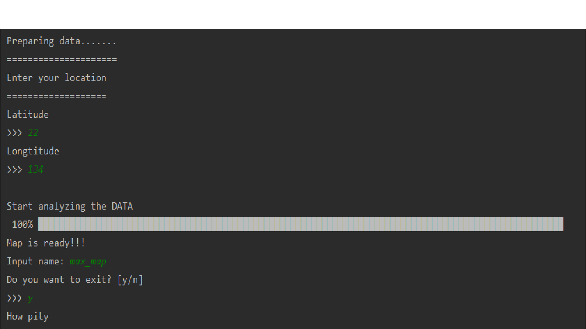
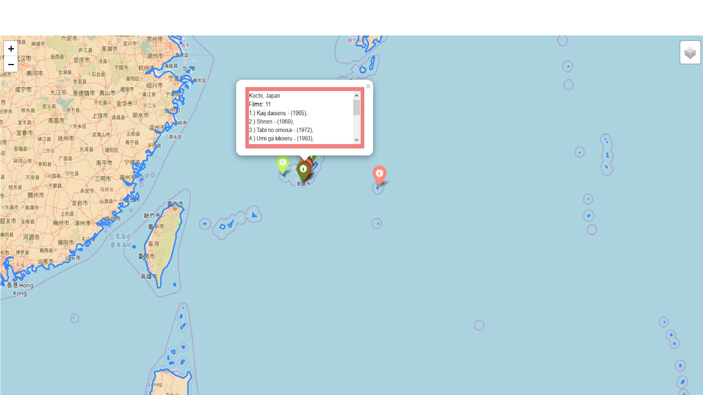
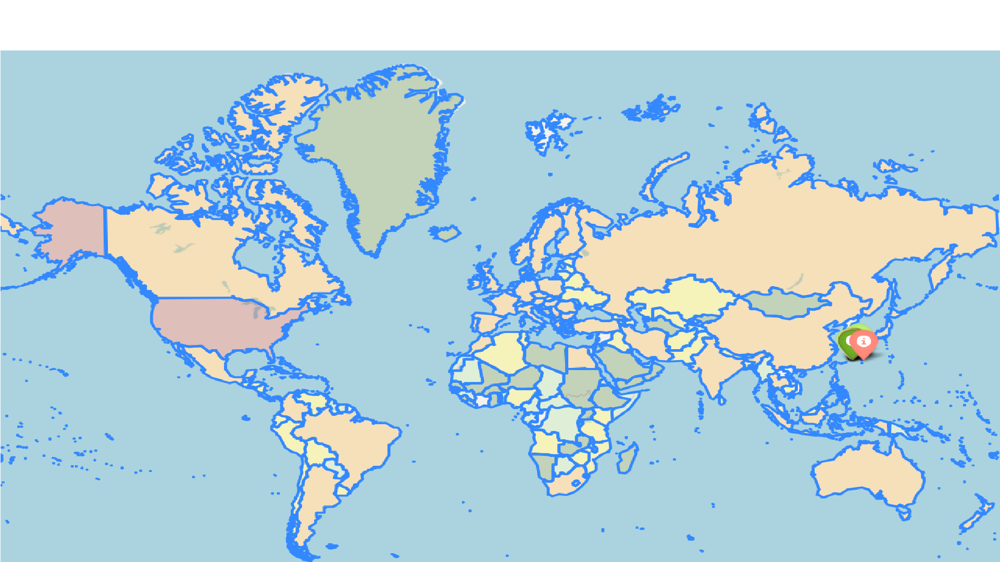

## Description & inf. that map provides

This project was launched to provide anyone willing to know more about the geography of cinematography with sufficient information organized in a convenient way. If the user wants to know about movies made nearby, all he/she should do is to input the latitude and longitude of the location he/she wants to get an information about (10 nearest places to it where at least one film was made and the list of films themselves). The application provides the user with geographic map (name.html file), which consists of three layers:

1. geographical map itself.

2. 10 colorful markers (the more reddish color is, the higher density of film made on this territory is) which when clicked on provides The user with information about films (title of film and its year, there are all the film from the oldest to the newest sorted and enumerated).

3. colored map responding to country’s territories colored from the lightest to the darkest color (light color represents countries with a few films made on their land and dark - countries with developed motion picture industry).

The best side of this project is that map is interactive, the user can zoom it in or out and move through the continents just moving mouse cursor. The data is visual and easy to understand intuitively, for example, coloring of markers and areas of continents. The information that map provides user with can be used in different ways from making charts of most film-advanced nation to rating areas with the highest film density. In other words, all user need is to know the coordinates of the area he/she is interested in and have a browser to open a map.

## Structure of HTML map

```<head>``` - information about HTML document <br />
```<meta>``` - adds machine readable information <br />
```<script>``` - adds JS <br />
```<link> ``` - defines relation between HTML and other external resources<br />
```<style>``` - adds more beauty to this world (use CSS)<br />
```<div>``` - adds scrollbar<br />

## Run examples



